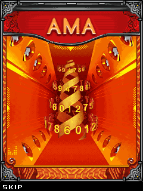
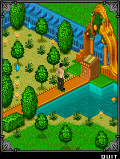
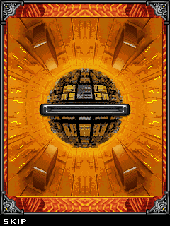
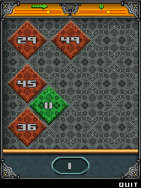
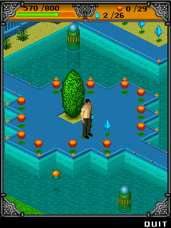
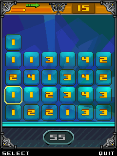
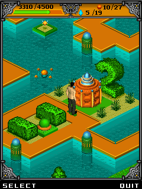
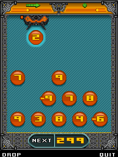
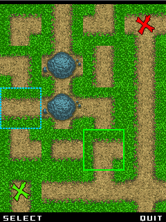
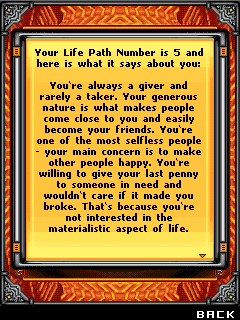

> AMA Games

### About Project

AMA is an independent interactive entertainment developer and publisher. Founded in 2004 by the Guillemot brothers, AMA is a sister company to Ubisoft, Gameloft, Guillemot Corporation and Longtail Studios. The company started as an independent developer and publisher of Lifestyle Games & Applications for mobile phones.

I released two apps during my time spent there. _AMA Are You Hot or Not_, a teen-oriented dress-up game and _Mystic Meg's Magic Numbers_, a story-connected collection of small games related to numerology. I also designed the company's WAP portals which contained all their apps and games. These were live on Telefónica ES and Sprint US carriers.

My work mostly involved game/level design along with everything that comes with that, such as writing the entire design documentation (game systems, user flows, wireframes), organizing playtests, prototyping ideas with the core team. All in all great fun until it came to porting the master version to less capable devices and cutting down features while still trying to keep the product together.

### Tech specs
* Platform: Nokia S60
* Release: 2006 - 2009
* Tech: In-house Java Engine (J2ME)
* Developer: AMA Mobile
* Website: [AMA Official](https://www.ama.bzh/)

### Media

