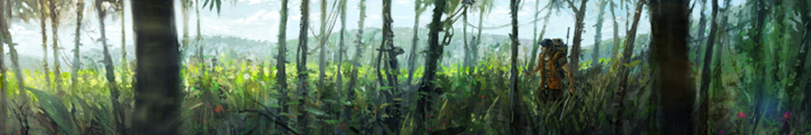
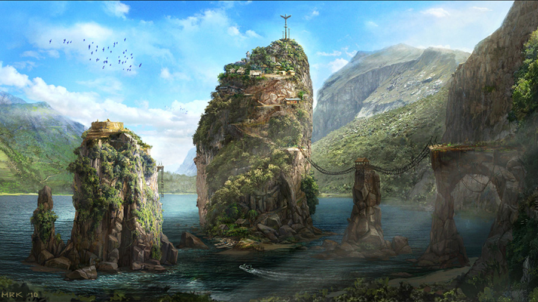
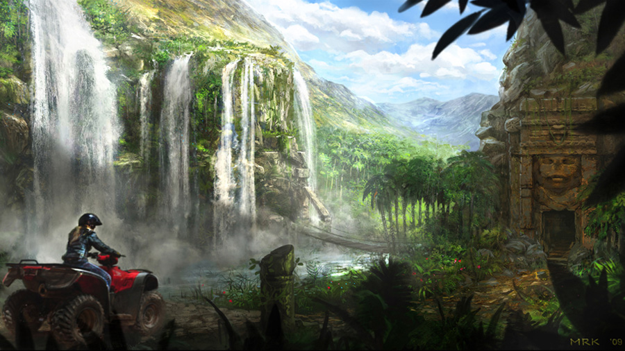
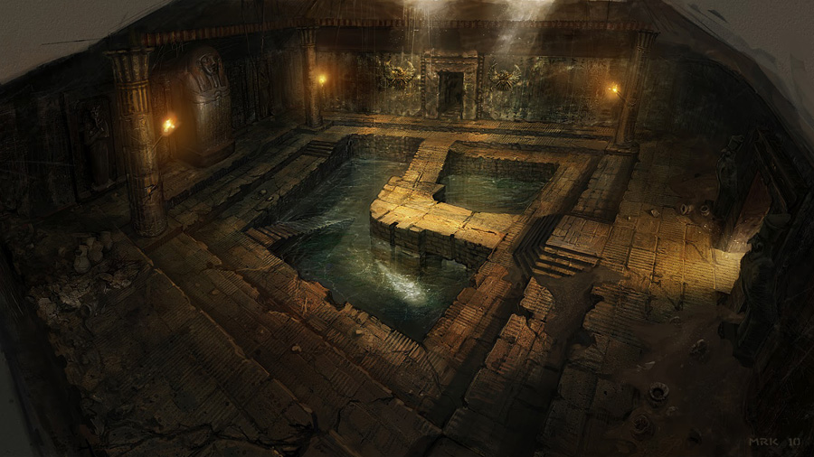
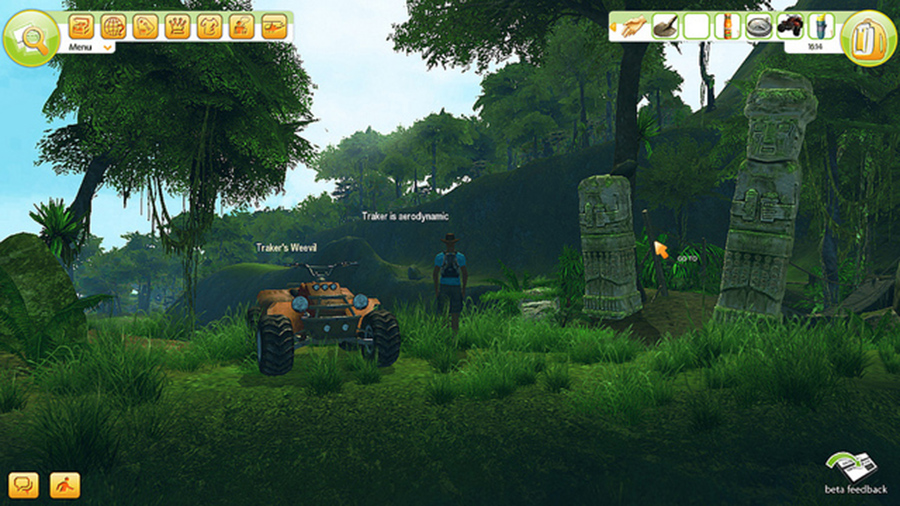
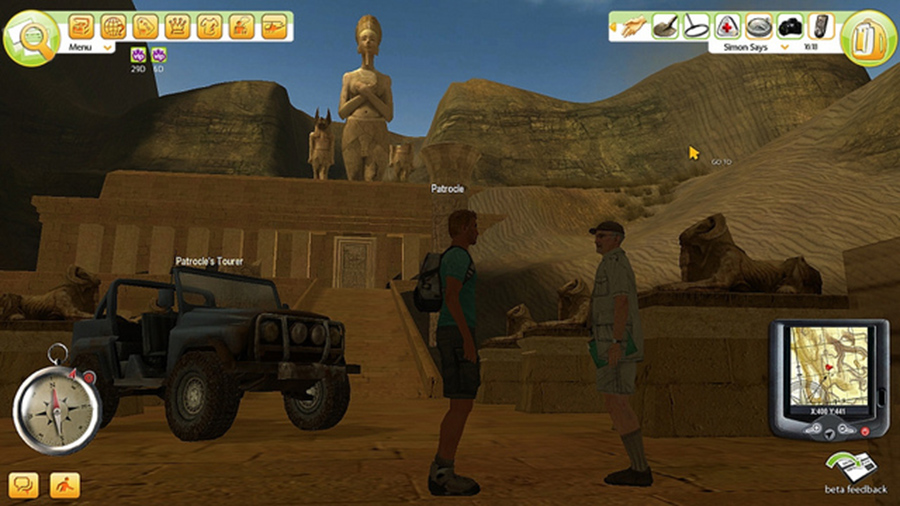
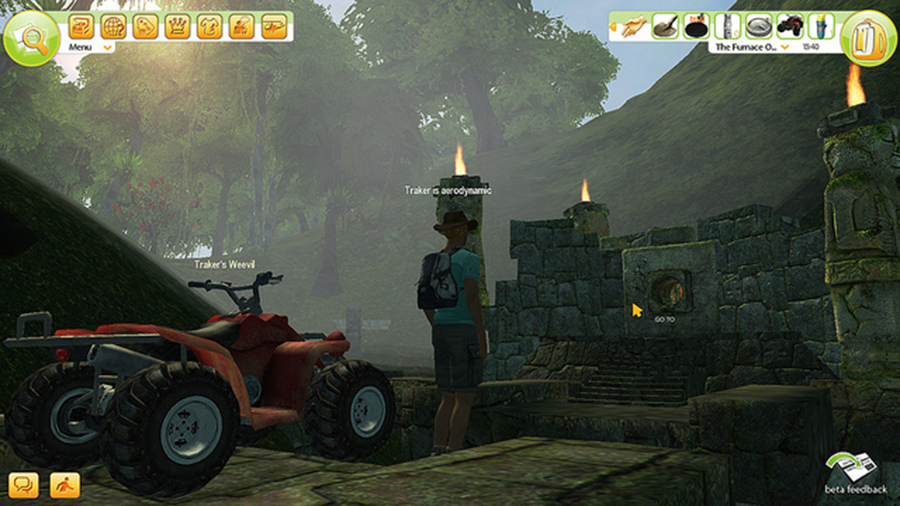

> Treasure Hunters Institute

### About Project

Treasure Hunters Institute (THI) was a F2P online adventure game aimed at challenging the mind with puzzles and riddles in a huge open-world environment. The first two worlds available were the ruins of ancient Egypt and the hidden jungles of Peru.

The experience was not story-driven, instead it was focused on world exploration and discrete quests which the player would choose to follow. The game would be released with a substantial amount of quests for player to finish, however the strong point was the quest creator and therefore the content published by players.

Since it was a bigger project with a lot more people involved my tasks were more focused than in mobile games. I worked on content creation tools for players to make their own game quests (UGC), designed character creation and customization systems as well as leveling and reward systems. Apart from that I was also heavily involved in designing UI controls and menu flows as well as the online (website) components of the game.

### Tech specs
* Platform: PC
* Closed Beta: October 2010
* Tech: FarCry Engine
* Developer: Ubisoft Bucharest // Ubisoft Montpellier // Ubisoft Sofia
* Website: [THI Facebook](https://www.facebook.com/TreasureHunterInstitute)

### Media

I have no idea who to credit for the concept/environment art.