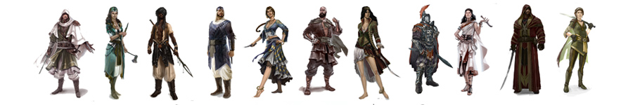
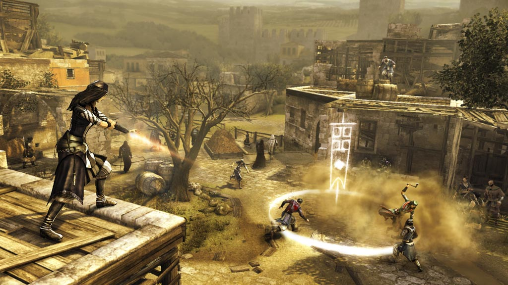
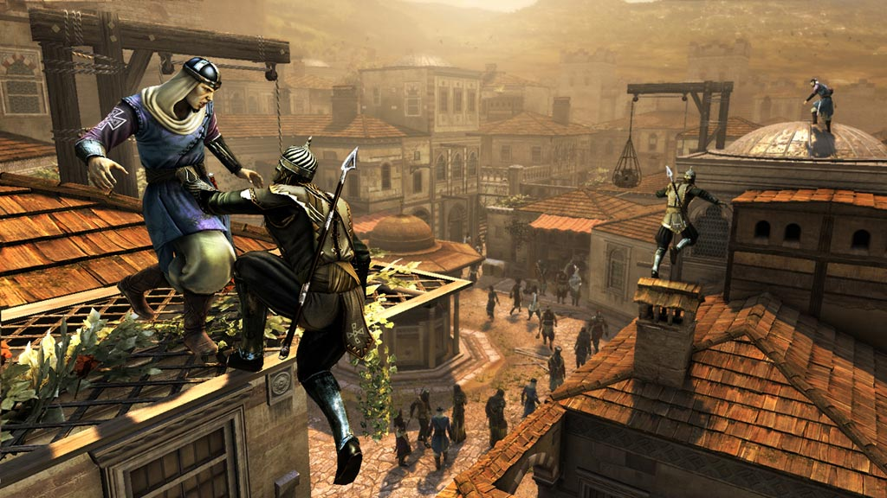
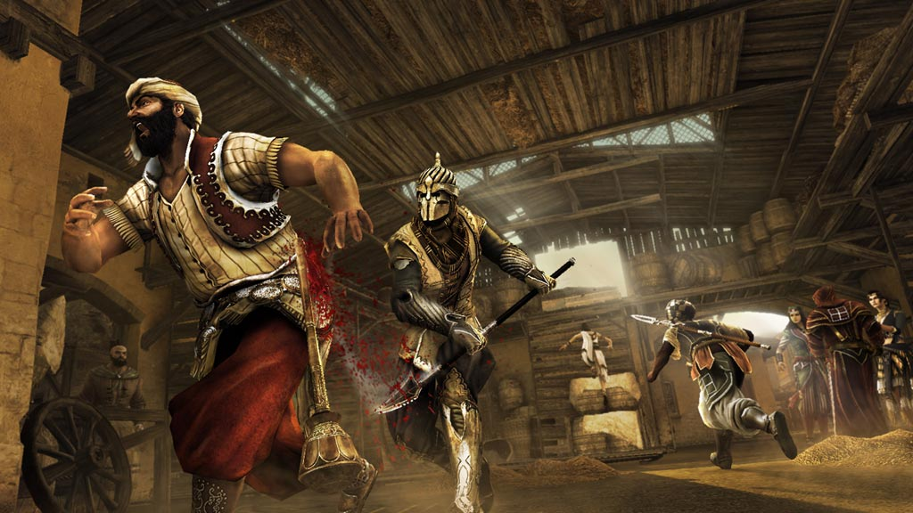
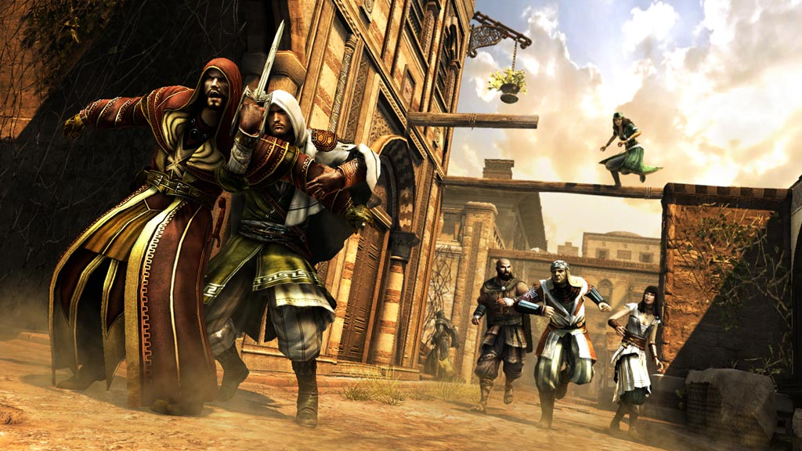
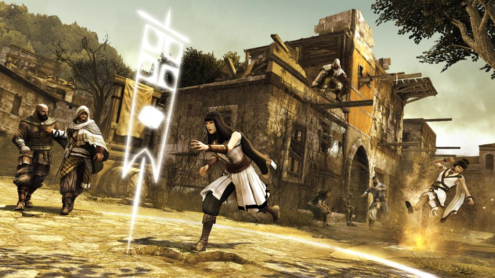

> Assassin's Creed: Revelations

### About Project

Assassin's Creed: Revelations is a 2011 historical fiction action-adventure open world video game developed by Ubisoft Montreal. It is a direct sequel and follow-up to 2010's Assassin's Creed: Brotherhood, Revelations is the fourth main installment of the series.

The main story follows the Assassin Ezio's journey to unlock the secret of Altaïr's vault in Masyaf using disc-like artifacts containing Altaïr's memories. Intersecting with these historical events are the modern day activities of Desmond, who relives Ezio's memories to find a way to fight against the Assassins' enemies, the Templars, and to prevent the 2012 apocalypse.

That has mostly nothing to do with the multiplayer part of the game which is what I worked on. The project was co-developed by Ubisoft Montreal, Annecy and Bucharest. The majority of my time on the project was dedicated to developing/prototyping new game modes and tweaking existing ones from the previous installment. There was a lot of fine tuning and balancing via daily reviews and playtests. I also worked on the design of the achievements and the data tracking parameters which allow _even finer tuning_ via analytics.

In the end the game turned out rather fun to play albeit not being really competitive. It's quite difficult to achieve competitivity and fairness in a game based on one-shot kills but that was part of the design challenge.

### Tech specs
* Platform: X360/PS3
* Release: November 2011
* Tech: Anvil Engine
* Developer: Ubisoft Montreal/Annecy/Bucharest
* Website: [Assassin's Creed Revelations (Official)](http://assassinscreed.ubi.com/en-us/games/assassins-creed-revelations.aspx)

### Media

