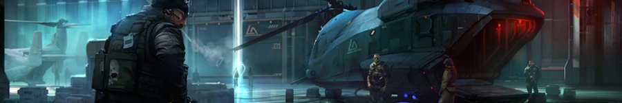
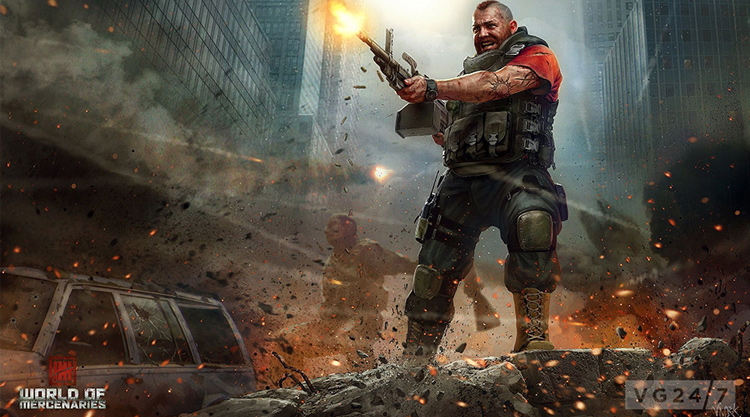
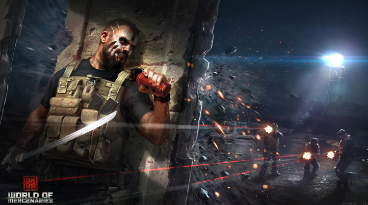
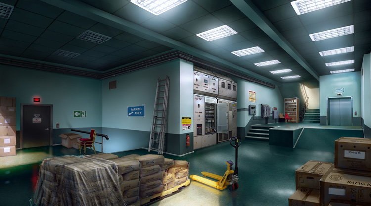
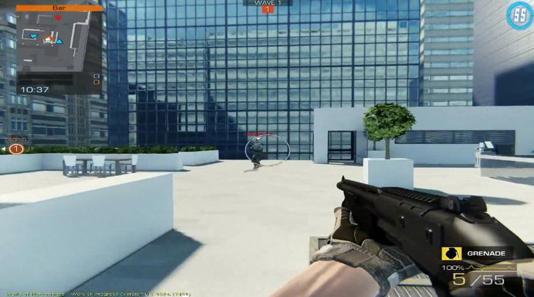
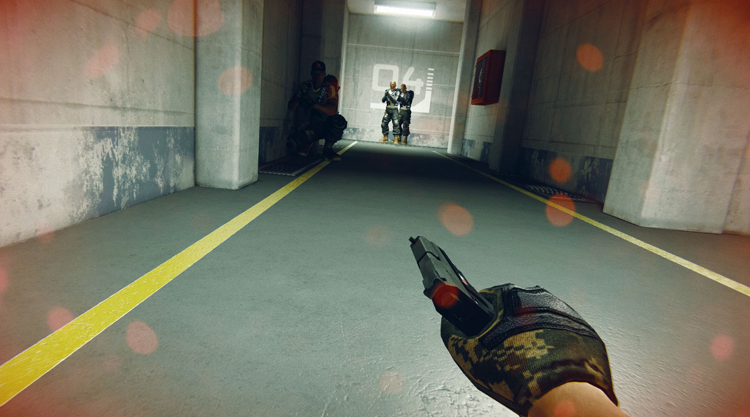

> World of Mercenaries

### About Project

World of Mercenaries was a skill-based first person shooter set in the near future. Modern FPS gunplay is combined with advanced weaponry and military gadgets to create a fun but challenging experience. Players can go for casual play or go full competitive by playing in ranked matches, joining clans or taking part in official competitions.

The game was trying to fill a gap in the F2P market by delivering AAA quality with none of the unfairness of pay to win mechanics. A closed beta for WoM was launched early 2012 and it was received with interest by the community but the project was eventually canceled in late 2012.

Back to a small team starting a new IP from scratch was quite refreshing but also very challenging and with a lot of unknown factors. My work revolved mostly around designing player progression and reward systems (XP system, achievements, challenges), character customization systems (cosmetics, load-outs) and some gameplay elements.

Other than that I also worked on social features (friends lists, groups, messaging) and competitive systems (teams, clans, events).

Oh. And a lot of playtesting. And fine tuning.

### Tech specs
* Platform: PC
* Closed Beta: May 2012
* Tech: Unreal Engine
* Developer: City Interactive Bucharest

### Media

If I remember correctly the environment/concept art is by [George Munteanu](https://www.behance.net/GeorgeMunteanu) and [Vlad Marica](https://www.artstation.com/vlad_mrk). Not really sure who did what but they make some amazing stuff you should check it out.