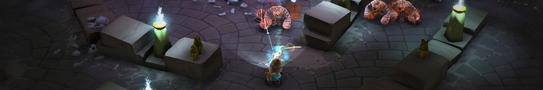
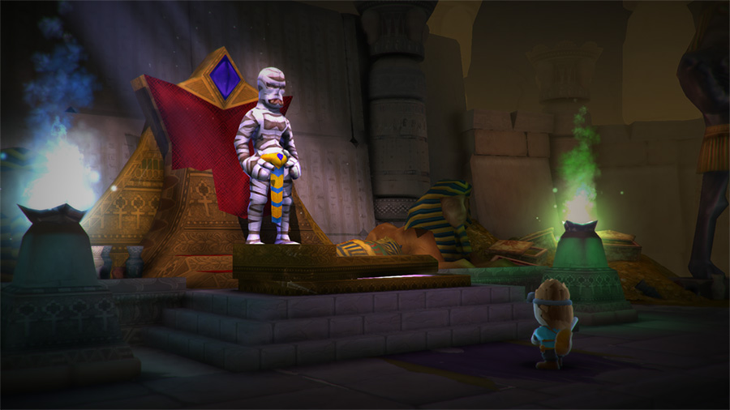
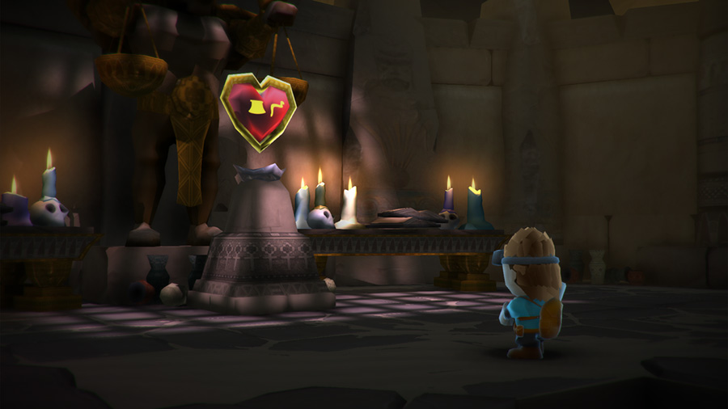
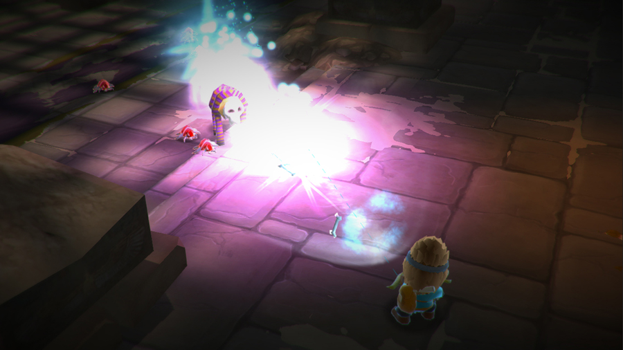
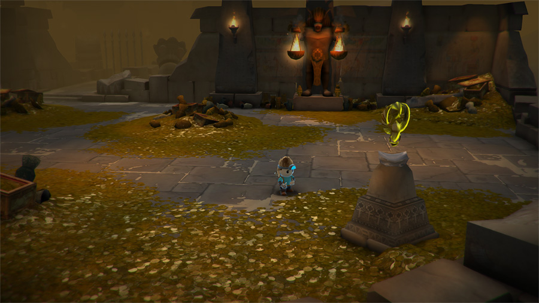
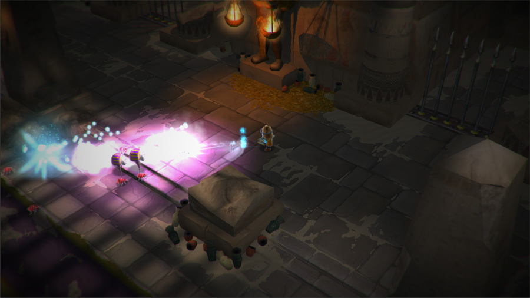

> Curse of Mermos

### About Project
Curse of Mermos is a lighthearted hack and slash game with fast paced action and challenging combat. It was developed during my collaboration with the twofour54 Gaming Academy as a Game Design Lecturer.

The game represents the final project of students enrolled at the Academy and it was brought to life in a studio simulation environment. I was one of the two teachers working full time with the students to oversee the production.

My overall role in the project was to make sure we have a clear design direction and that we stay on track with the production schedule. Admin-wise I set up the development pipelines and processes and handled sprint planning. On the design side I oversaw the progress of game and level design, set up Rational Level Design methodologies and playtesting framework.

I also handled the technical setup, deploying and maintainig tools (Jira, SVN, back-up scripts) and in between I built a [tool for analyzing playtest data](https://github.com/treipatru/Playtest-Data-Visualizer) which in itself was a really interesting side-project.

It was really fun to work on this game, probably my favorite in _the industry_ so far and the one that opened my eyes about what it actually means to get a product out there when you have no _big business_ support.

### Tech specs
* Platform: PC
* Release: January 2015
* Tech: Unity3D Engine
* Developer: TEAM110
* Website: [Curse of Mermos](http://www.curseofmermos.com/)
* Downloads: [steam](http://store.steampowered.com/app/352160/) | [itch.io](http://team101.itch.io/curse-of-mermos) | [indiedb.com](http://www.indiedb.com/games/curse-of-mermos1/downloads)

### Media
> Launch trailer

> Screenshots

